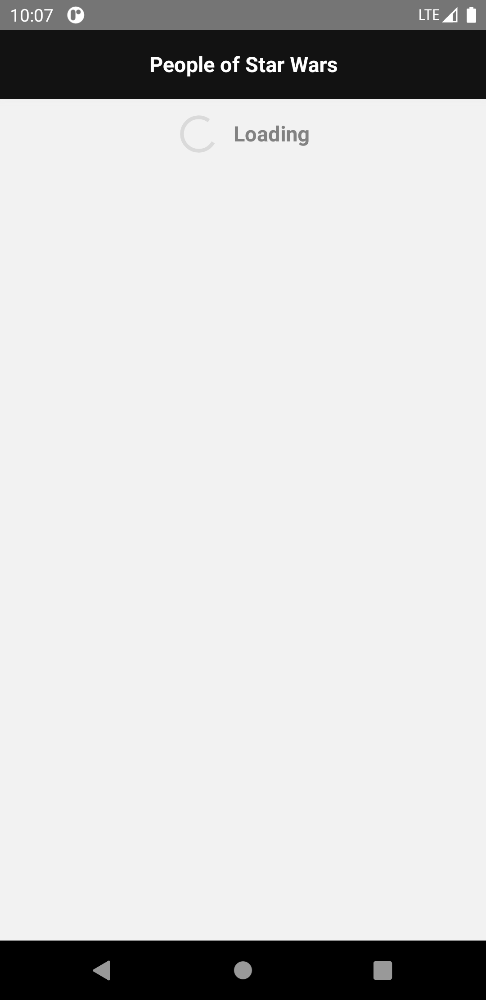
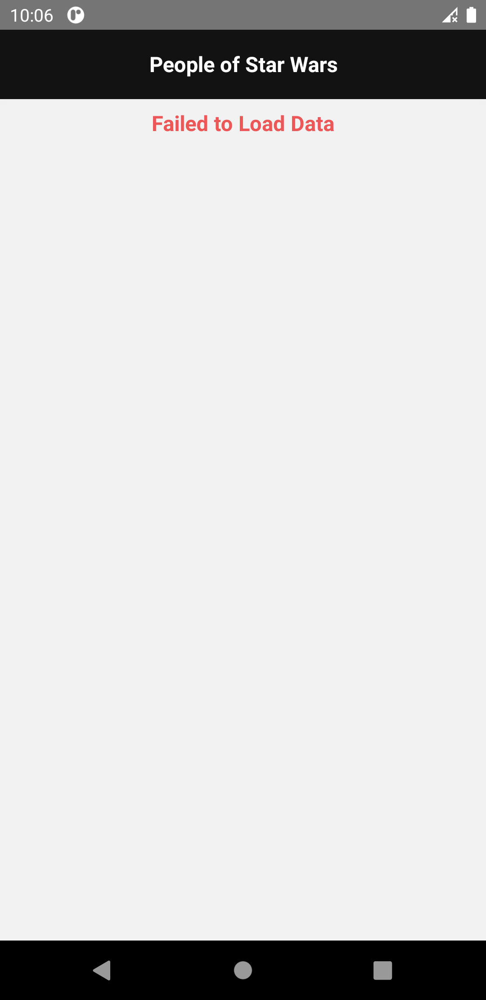
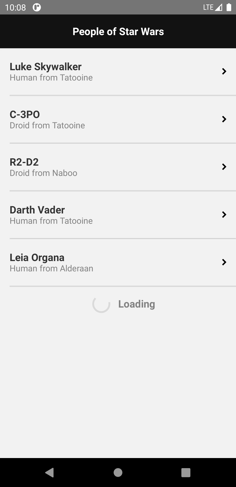
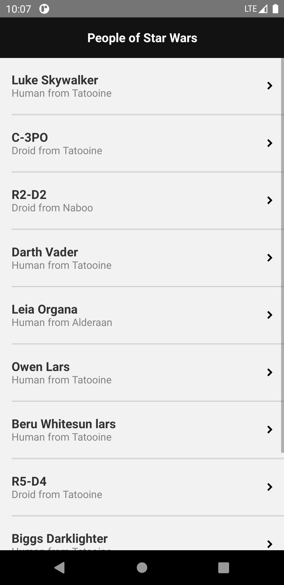
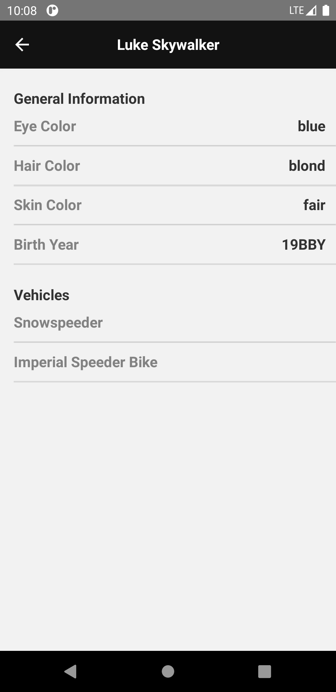

# Ravn GraphQL Code Challenge
This is an Android mobile app that allows you to browse all the characters in the Star Wars GraphQL API. 

## Technologies 

- [React Native](https://github.com/facebook/react-native)

> A framework for building native apps for Android and iOS using React.

- [React Navigation](https://www.apollographql.com/docs/react)

> Stack navigator for use on iOS and Android.

- [Apollo Client](https://www.apollographql.com/docs/react)

> A library for JavaScript that enables manage data with GraphQL.

## Running the project

### Prerequisites
- [Install Android Studio ](https://developer.android.com/studio) on your computer.
- [Install NodeJS](https://nodejs.org/en/) on your computer.
- Install react-native-cli globally on your computer.
```
yarn global add react-native-cli
```
### Setup
- Clone this project
```
git clone < project-url.git >
```
-  Install dependencies.
```
npm install
```


### Run project

- Launch a virtual android device [(through *Android Studio* for instance)](https://developer.android.com/studio/run/managing-avds.html#viewing)

> If you have never installed any android virtual device, [follow those instructions](https://developer.android.com/studio/run/managing-avds.html#createavd)

- Then, run the project:
```
react-native run-android
```

## Project Description
The project consumes a GraphQL-based service to display all the characters in the Star Wars universe and allows us to select each character to display information about them. 

### Project structure
The project has four main folders: screens contains the differents presentations of the app, api has the configuration and the queries of graphql, components is composed of the objects neccesary to solve the challenge, navigation has the configuration necesary to move on the app, App.js works like a main root of the project, and finally theme control the style of the application.
```
starwars 
└── src
    └── api
    │   ├── Client.js
    │   ├── Query.js
    ├── components
    │   ├── Detail
    │   │   ├── Detail.js
    │   │   └── Detail.style.js
    │   ├── ItemList
    │   │   ├── ItemList.js
    │   │   └── ItemList.style.js
    │   ├── List
    │   │   ├── List.js
    │   │   └── List.style.js
    │   ├── Loading
    │   │   ├── Loading.js
    │   │   └── Loading.style.js
    │   └──
    ├── navigation
    │   └── StackNavigator.js 
    ├── screens
    │   ├── Home.js
    │   └── Info.js    
    ├── App.js
	└── theme.js
```
### Navigation

When the application starts it will try to load the first 5 characters and you will see the loading icon.
<p align="center"> </p>
If the query fails for any reason it will display an error notice.
<p align="center"> </p>
The application will load the characters 5 by 5 using pagination until all are loaded.
<p align="center">
 </p>
If you click in one of the characters the app will load the information of the selected character.
<p align="center"> </p>
 
## Additional information


